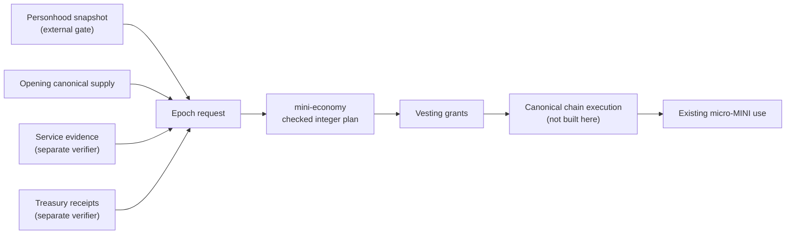

# Day-0 monetary kernel — implementation proposal

**Status:** proposed engineering evidence; not activated monetary policy
**Scope:** D-0073, D-0074, roadmap #46–#51, #99
**Implementation:** `mini-economy`, `mini-econ-sim`

## Outcome

This proposal turns the already-selected MINI issuance envelope into a small,
deterministic kernel without changing how current payment claims denominate
or use MINI. It does not redesign MINI, create launch balances, activate
mainnet, or close external audit and personhood gates.

The intended long-horizon property is not “one token contains every asset.”
MINI can become a common medium for valuing and exchanging human goods,
services, digital objects, and user-selected external assets. Mininet must not
pretend it owns those things, guarantee their price, or create a protocol
redemption claim against third-party property. Representation is a signed,
typed claim at the edge; ownership and custody remain with the relevant human,
ledger, or provider.

## Reconciliation of existing doctrine

The implementation preserves:

1. **Existing units and use.** Current settlement APIs remain `u64`
   micro-MINI. The accounting kernel uses `u128` micro-MINI internally, so
   every old amount widens exactly with no rounding or wire change.
2. **D-0074 issuance.** Annual issuance is bounded to 3% of opening
   circulating supply: 2% Human Share, at most 0.75% service rewards, and at
   most 0.25% treasury contributions.
3. **Equal Human Share.** The epoch amount is divided by the count of eligible
   humans, never by balance, stake, hardware, reputation, age, birthplace, or
   joining date. Integer remainder stays unissued.
4. **Voice/value separation.** The kernel has no governance-weight output.
   No balance-dependent governance dependency is introduced.
5. **Property and finality.** This module plans issuance; it does not CRDT
   merge money, reverse transfers, confiscate dormant balances, or call an
   offline claim final.

## State-machine boundary



Inputs must already be canonical and independently authorized. The kernel
rejects empty or duplicate human sets, duplicate optional beneficiaries,
invalid durations, arithmetic overflow, channel overruns, and aggregate
overruns. It cannot authenticate those inputs and must not be called directly
from a UI as if planning were mint authorization.

## Genesis without inherited privilege

There is a genuine tension between the older “present-world-value genesis
tranche” language and D-0074’s later rule that no founding generation gets a
finite privileged bag. `build_genesis` resolves only the mechanical portion:

- every supplied eligible human receives exactly the same locked amount;
- ordering cannot change the output;
- duplicate identities fail closed;
- the chain id, constitutional digest, amount, vesting duration, and sorted
  recipient set are content-addressed; and
- there is no founder, investor, institution, operator, or hidden reserve
  field.

The function deliberately takes `bootstrap_per_human` and the eligible set as
inputs. Choosing either is governance-sensitive and depends on a credible
personhood snapshot. Until that exists, the safe production bootstrap amount
is **not determined**. Tests may use non-zero values; mainnet may not infer
them from test fixtures.

External assets and existing claims can be described through separately
signed attestations or user-selected providers, but they do not justify
minting MINI unless a separately adopted policy explicitly authorizes it.
There is no “all world wealth” oracle capable of assigning a correct,
non-coercive universal valuation.

## Epoch algorithm

For an epoch of duration `d <= 365 days`, each cap is:

```text
floor(opening_circulating_micro × annual_rate_ppm × d
      / (1_000_000 × 365_days_ms))
```

Human issuance is:

```text
per_human = floor(human_cap / eligible_human_count)
issued = per_human × eligible_human_count
```

The scalable path binds those values to a `HumanSnapshot { root,
eligible_count }` and returns one aggregate instruction in constant space.
The personhood layer and chain must define canonical snapshot construction,
private membership proofs, one-claim-per-member nullifiers, and replay
protection. The explicit-recipient path remains useful for bounded ceremonies
and deterministic test vectors; it is not the billion-person ledger format.

Optional service and treasury allocations must already fit their caps. Unused
capacity expires; it cannot be rolled forward, moved between channels, or
used to create a discretionary reserve. Human grants carry the D-0074
365-day vesting period and treasury grants the D-0073 90-day period. Service
maturity remains evidence-policy-specific; the envelope does not invent one.

## Thousand-year durability

`u128` atomic accounting has approximately 3.4×10^38 possible units. At six
decimal places this is approximately 3.4×10^32 MINI. This is implementation
headroom, not a promise that perpetual 3% growth is economically desirable.
All multiplication and addition are checked and fail closed.

Durability also requires:

- versioned canonical serialization before ledger integration;
- crypto-agile signatures and an exercised post-quantum migration;
- replicated, independently verifiable supply checkpoints;
- no dependence on one company, chain bridge, price oracle, operating system,
  AI model, or treasury;
- denomination display changes that never alter atomic ownership; and
- explicit sunset/migration procedures for obsolete representations.

No code can guarantee value for 1,000 years. It can preserve exact ownership
rules, avoid privileged issuance, make changes auditable, and permit future
humans to adopt safer implementations without granting the present generation
permanent control.

## Inclusion requirements

Issuance equality is necessary but insufficient. A launch implementation must
support intermittent connectivity, disability and assisted access, device/key
loss recovery, low-resource hardware, private presence, minors and future
entrants, displacement, censorship, and participants without banking access.
Failure to meet presence cannot destroy vested property. A helper, custodian,
employer, state, or resident AI must not acquire the human’s vote or future
Human Share.

## Integration sequence

1. Externally review the personhood snapshot and bootstrap policy.
2. Add versioned canonical encodings for manifests, epoch requests, and grants.
3. Have chain execution verify the opening-supply checkpoint, policy id,
   epoch uniqueness, evidence roots, and mint authorization.
4. Add a ledger-wide supply invariant and replay tests.
5. Make wallet balances distinguish locked, vesting, available, pending, and
   externally represented value.
6. Migrate existing reward “points” only through an explicit reconciliation
   decision; never silently convert demo points into money.
7. Run economic, cryptographic, custody, accessibility, and adversarial
   external reviews before real-value activation.

## Explicitly unresolved

- Sybil-resistant personhood and privacy-preserving liveness.
- The bootstrap amount, eligibility cutoff, and launch snapshot.
- Service reward curves and proof quality.
- Oracle manipulation and external-asset valuation.
- Fee-market/security-budget calibration.
- Treasury custody and bridge integration audits.
- Price stability, liquidity, tax, consumer-protection, and jurisdictional
  treatment.
- Coercion-resistant voting and post-quantum live-break migration.

These are launch gates, not TODOs that this arithmetic crate can honestly
close.
