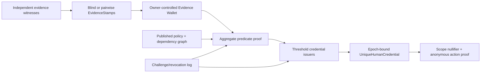
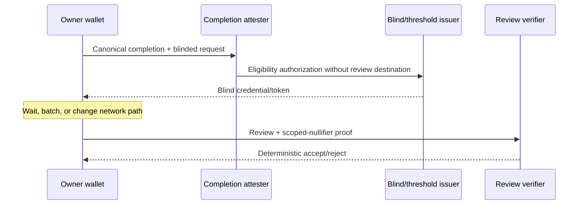
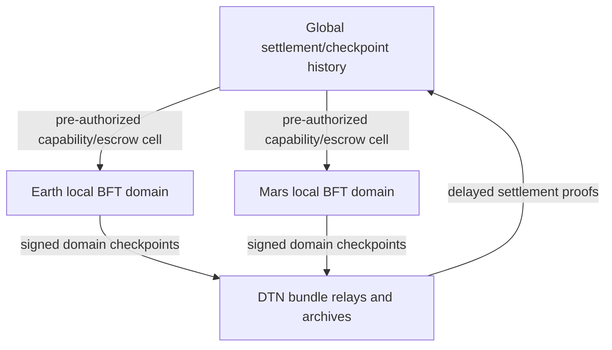

# Frontier personhood, privacy, governance, and consensus proposals

**Status:** Research and design proposal; not accepted, not implemented, and not a
production-security claim

**Prepared:** 2026-07-22

**Repository baseline:** `a0826b4de4d6b01005a332c304f2ee8d0c6bb18e`

**Scope:** Six unresolved problems, in the order requested: Sybil-resistant
personhood; privacy-preserving continuity/liveness; `mini-attest`; post-quantum
live-break recovery; coercion-resistant voting; and interplanetary/advanced-AI
consensus threats.

This document proposes research and implementation paths. It does not turn an
open research question into a shipped property by naming types or writing a
zero-knowledge circuit. Every section separates what can be engineered now,
what must be experimentally falsified, what requires independent cryptographic
review, and what remains impossible under the stated adversary.

## 0. Executive recommendation

Mininet should create one coordinated **Frontier Trust Program**, while keeping
six separate acceptance gates. The work shares cryptographic plumbing and
adversarial simulations, but the outputs have different authority:

| Workstream | Recommended first deliverable | Earliest honest maturity |
|---|---|---|
| 1. Personhood | Epoch-bound `UniqueHumanCredential` research prototype backed by diverse `HumanEvidence` | Non-governance public pilot |
| 2. Private continuity | Local evidence wallet and aggregate ZK predicate over mock/signed stamps | Research prototype |
| 3. `mini-attest` | Explicitly linkable Tier-0 receipt, then issuer-unlinkable membership research | Edge-layer beta after audit |
| 4. PQ live break | Pre-provisioned PQ anchors, last-safe-checkpoint drill, and three recovery classes | Testnet emergency exercise |
| 5. Coercion-resistant voting | Declared coercion levels and deniable re-voting prototype | Advisory polls before binding votes |
| 6. Interplanetary/AI | DTN simulation, partition escrow, and authority-safe AI controls | Simulation and formal-spec work |

The program should use a common gate vocabulary:

- **R0 — problem statement:** adversary, assumptions, privacy budget, excluded
  claims, and measurable success criteria are written.
- **R1 — executable model:** deterministic model, test vectors, and attack
  simulations exist; no live authority or value depends on it.
- **R2 — prototype:** two interoperable implementations pass negative tests on
  weakest supported devices.
- **R3 — adversarial pilot:** bounded users/value, published residual risks,
  privacy measurements, red-team results, and rollback.
- **R4 — externally reviewed candidate:** independent cryptography, protocol,
  accessibility, and implementation audits are resolved.
- **R5 — governed activation:** a separate exact decision activates a specific
  artifact and parameters. A research document cannot do this.

No section below should pass directly from R1 to production. Personhood,
governance, consensus, and value paths remain subject to the external-audit
requirement in `A1`.

### Repository alignment and non-negotiable boundaries

This proposal extends, but does not supersede:

- [`human-continuity-proof.md`](human-continuity-proof.md), which already
  defines private continuity as a design-only replacement for signal `b`;
- [`human-evidence-taxonomy-reconciliation.md`](human-evidence-taxonomy-reconciliation.md)
  and [`credential-taxonomy.md`](credential-taxonomy.md), which keep evidence
  separate from credentials and roles;
- [`issue-18-sybil-social-graph-review.md`](../audits/issue-18-sybil-social-graph-review.md),
  whose completed review did not solve personhood;
- [`post-quantum-identity-migration.md`](post-quantum-identity-migration.md) and
  [`PQ15_POST_QUANTUM_MIGRATION_RESEARCH_20260715.md`](../research/PQ15_POST_QUANTUM_MIGRATION_RESEARCH_20260715.md);
- [`networked-consensus.md`](networked-consensus.md), the current networked
  Tendermint-style design;
- `D8`, `D9`, `D11`–`D16`, `D18`, `P2`, `P5`, `X2`, `V1`, and `A1`; and
- `INV-18-01`–`INV-18-08`: an edge/provider result must never become a
  humanness signal, governance credential, or vote.

The design distinguishes five objects that must never collapse into one:

1. **Identity root:** a durable controller and key-event history.
2. **Human evidence:** bounded claims relevant to continuity or uniqueness.
3. **Unique-human credential:** an epoch- and policy-bound eligibility claim.
4. **Anonymous action proof:** proof that an eligible holder may perform one
   scoped action without revealing the holder.
5. **Role/resource/edge credential:** authority or capacity for a specific
   non-personhood purpose.

An identity root is not a verified human. Resource expenditure is not a human.
Engagement is not a human. Reputation is not a human. A zero-knowledge proof
can hide inputs and prove a predicate; it cannot make false sensor input true.

## 1. Sybil-resistant personhood

### 1.1 Precise problem and honest target

Issue #18 is closed because its requested social-graph adversarial review was
completed, not because Sybil-resistant personhood was solved. Mutual edges,
live vouching, and SybilRank-like weighting improve one attack surface, but the
review leaves purchased relationships, sleeping identities, seed capture,
nation-state farms, and production parameter calibration unresolved.

The target must not be “prove that this key is exactly one biological human.”
In an open network, that claim is unavailable without assumptions about a
trusted admission authority or scarce resource. Douceur's foundational result
shows why decentralized systems cannot generally prevent Sybils without such
an assumption. Social-graph systems add assumptions such as limited attack
edges and sufficiently mixing honest regions; they do not remove assumptions.

The defensible target is:

> For a named policy and epoch, issue at most one active credential per person
> with measured false-acceptance, false-rejection, privacy, concentration, and
> attack-cost bounds, under an explicit set of independent evidence-domain and
> corruption assumptions.

This is **risk-bounded uniqueness**, not a metaphysical identity oracle.

### 1.2 Threat model

The R0 model must include at least:

- one operator creating many roots and devices;
- paid real humans lending, selling, or continuously operating credentials;
- dense friendship farms, sleeping Sybils, and slow trust cultivation;
- compromised evidence issuers and correlated issuers under common control;
- captured seed cohorts, bribed witnesses, and coercive governments;
- replay, credential sharing, simultaneous old/new use, and recovery abuse;
- malware on the participant device and dishonest sensor inputs;
- exclusion of people without documents, stable homes, smartphones, money, or
  safe social relationships;
- targeted denial of credentials to dissidents or minorities;
- cross-context tracking by issuers, verifiers, relays, or network observers;
- an adaptive adversary that optimizes after scoring rules become public; and
- a nation-state able to combine legal compulsion, datasets, traffic analysis,
  device compromise, and large numbers of genuine participants.

### 1.3 Proposed architecture

The existing `HumanEvidence` taxonomy remains the input vocabulary. Add a
research-only output named `UniqueHumanCredentialV1` only after the following
components exist.



#### A. Evidence wallet

Raw evidence stays on the participant's device. Witnesses issue minimal,
short-lived `EvidenceStampV1` objects to pairwise or blinded commitments. Each
stamp contains only:

```text
version
class_id
dependency_domain_id
issuer_key_id
subject_commitment
coarse_validity_epoch
assurance_bounds
revocation_handle_commitment
issuer_signature_or_blind_credential
```

It must not contain a global DID, exact location, contact graph, document
number, biometric template, website name, or stable cross-domain identifier.
The `dependency_domain_id` is critical: three issuers using the same identity
vendor, device attestation service, or government database are one correlated
source, not three independent facts.

#### B. Published personhood policy

`PersonhoodPolicyV1` is a content-addressed, versioned object containing:

```text
policy_hash
valid_epoch_range
accepted_evidence_classes
issuer/dependency-domain registry snapshot
minimum class and domain diversity
per-domain contribution caps
temporal-spread and recent-liveness predicates
assurance-band boundaries
credential lifetime
challenge and revocation rules
proof-system and parameter identifiers
weakest-device performance ceiling
```

Policies are public and deterministic. They may change only between epochs.
They may not use wealth, stake, storage, provider engagement, paid consumption,
content popularity, political belief, or model-assigned “good citizen” scores.
A policy change never silently reinterprets an old credential.

#### C. Aggregate proof

The owner proves, without revealing stamps, that:

- every counted stamp is authentic, current, and not revoked;
- the stamps bind to one owner secret;
- class, dependency-domain, temporal-spread, live-vouching, and cap predicates
  satisfy the exact policy hash;
- no forbidden class contributes;
- the credential epoch and policy are public; and
- a credential-request nullifier has not already been accepted for this owner
  in that epoch.

Use integer/fixed-point predicates and closed enums. Do not put opaque machine
learning, proprietary fraud scores, or remotely mutable policy inside the
circuit. The proof system must be chosen after a measured bake-off covering
proof size, verifier cost, prover memory, mobile battery, setup assumptions,
recursion, audit maturity, and post-quantum implications.

#### D. Distributed issuance and bootstrap

One issuer would recreate the logically centralized authority identified in
the Sybil literature. A threshold of independently operated issuers should
blindly issue the same policy-bound credential after verifying the aggregate
proof. Threshold issuance reduces single-issuer censorship and compromise but
does not magically guarantee independence; legal ownership, hosting,
implementation, funding, and jurisdiction concentration must be measured.

Bootstrap is an explicit exception, not hidden circularity:

- publish the finite genesis cohort and selection procedure;
- require several admission paths, including a no-government-ID and a
  low-connectivity path;
- expire genesis authority and reduce its relative influence each epoch;
- prevent one genesis member or organization from directly admitting a
  controlling fraction;
- publish issuer and dependency-domain concentration metrics; and
- permit challenges without publishing the challenged person's evidence.

If no credible independent issuer set can be formed, stop at R2. Calling one
foundation a “distributed committee” would not solve the trust problem.

#### E. Credential and nullifiers

The credential should reveal no stable identifier:

```text
UniqueHumanCredentialV1 {
  version,
  policy_hash,
  epoch,
  assurance_band,
  holder_secret_commitment,
  expiry_epoch,
  revocation_handle_commitment,
  threshold_credential
}
```

For action context `c`, derive
`nullifier = PRF(holder_nullifier_secret, domain_separator || c || epoch)`.
The proof shows valid membership and correct nullifier derivation. One context
therefore admits one action, while different proposals/services/epochs remain
cryptographically unlinkable. The context definition must be canonical;
verifier-chosen personalized contexts would partition anonymity sets and track
users.

#### F. Recovery and duplicate suppression

Recovery must atomically move the credential binding from an old identity root
to a new one. During a cooling window both roots are quarantined from creating
new governance nullifiers. A completed recovery publishes a credential-level
supersession commitment, not the person's evidence. Simultaneous use or two
successful recoveries freezes the credential pending the explicit dispute
process. “First request wins” is not safe recovery.

### 1.4 What not to build

- No global face, fingerprint, voice, gait, location, or social-graph database.
- No permanent public “verified human” badge tied to a DID.
- No single mandatory government credential or hardware vendor.
- No score whose weights can be changed remotely or learned from undisclosed
  training data.
- No proof-of-work, stake, storage, phone number, CAPTCHA, engagement, or fee as
  a substitute for humanity.
- No governance activation while the only evidence is a prototype signal.

### 1.5 Research and implementation plan

1. **R0 — definitions and datasets:** create a privacy-safe synthetic graph and
   agent simulator for the exact attacks left by issue #18. Record population,
   geography, accessibility, coercion, issuer-correlation, and market models.
2. **R1 — attack economics:** compare current graph scoring, the existing
   continuity threshold, and candidate policies. Publish sensitivity analyses;
   never present one parameter set as universal.
3. **R1 — protocol specification:** specify canonical serialization,
   commitments, nullifiers, revocation, recovery, epochs, and issuer rotation.
4. **R2 — two prototypes:** implement independent prover/verifier stacks and
   mock issuers. Use synthetic evidence only.
5. **R2 — weakest-device tests:** measure low-end Android proof time, peak RAM,
   battery, storage, offline operation, and accessible recovery.
6. **R3 — non-governance pilot:** issue credentials that unlock no vote, money,
   moderation power, or scarce public resource. Measure exclusion and abuse.
7. **R4 — audits:** cryptography, protocol composition, issuer governance,
   mobile implementation, privacy, human-rights/accessibility, and simulation.
8. **R5 — separate decision:** only a later governed proposal may bind one
   audited version to a narrowly defined action.

### 1.6 Acceptance and falsification gates

The project should set numeric thresholds before experiments. Candidate metrics
include mature-Sybil acquisition cost and time, false-accept/reject rates by
accessibility cohort, issuer and domain concentration, challenge abuse, proof
linkability, recovery collision rate, mobile resource use, and percentage of
users needing an unavailable evidence path.

Reject or redesign the candidate if any of these occur:

- a single issuer/dependency domain can independently cross the threshold;
- common metadata or proof timing links contexts beyond the declared bound;
- a farm can cheaply mature credentials under realistic purchased-human and
  slow-attack models;
- protected or low-connectivity cohorts fail materially more often without an
  equally private alternative;
- policy updates can retrospectively deanonymize or invalidate holders;
- recovery permits simultaneous old/new voting; or
- independent auditors cannot reproduce the simulation results.

### 1.7 Residual unsolved problem

Even a successful design cannot stop a real person from acting for an attacker,
sharing all secrets, or being continuously coerced. It cannot prove that
issuers are organizationally independent merely because they use different
keys. It cannot guarantee global biological uniqueness without accepting a
trust or physical-world assumption. The correct shipped statement would be
“credential satisfied policy P in epoch E,” never “this is certainly one
unique human.”

## 2. Privacy-preserving liveness/personhood proof

### 2.1 Reframe “behavioral/location entropy”

Do not build a centralized or opaque “human behavior score.” Behavioral traces
and fine location are exceptionally identifying, culturally biased, and easy
to turn into surveillance. Zero knowledge hides a witness while proving a
predicate over it; it does not prove that a compromised phone supplied true
sensor data.

The research target should therefore be a **Private Human Continuity Proof**:
a proof that one owner secret accumulated enough fresh, diverse, independently
witnessed evidence over time, while revealing only a policy hash, epoch,
assurance band, and scoped nullifier.

“Entropy” should mean measured diversity across closed evidence classes,
dependency domains, and time buckets—not Shannon entropy over a person's raw
trajectory or app behavior.

### 2.2 Layered design

#### Layer 1 — provenance before privacy

Every input needs a provenance class:

- **cryptographic co-presence:** two devices exchange fresh nonces over a local
  channel and later receive independently signed stamps;
- **continuing device/home relationship:** a pre-enrolled local device signs a
  fresh challenge, without exposing a hardware serial;
- **selective web continuity:** a zkTLS/MPC-TLS transcript proves a narrow
  predicate about an authenticated session, not the page or account name;
- **coarse region predicate:** several independent beacons or witnesses attest
  that a committed coordinate/time was inside a broad region;
- **credential predicate:** an issuer proves only a necessary attribute, such
  as “credential current,” never the identifier; and
- **live human interaction:** a fresh, rate-limited challenge witnessed by
  existing participants, without storing audio/video/biometrics.

No class is inherently truthful. Each has an issuer, corruption assumption,
replay boundary, accessibility cost, and dependency domain. Hardware
attestation may improve input integrity but creates vendor and device-access
dependencies, so it must remain optional and capped.

#### Layer 2 — on-device minimization

The client converts observations immediately into coarse features and deletes
raw inputs after the shortest defensible retention period:

```text
class_id | dependency_domain | coarse_epoch | assurance_interval |
subject_commitment | freshness_nonce | revocation_handle
```

Exact coordinates become region membership; timestamps become broad buckets;
web sessions become named predicate IDs; co-presence becomes a one-time event.
The app must show what is being proved before collection and allow deletion or
export of every local stamp. Backups remain owner-encrypted.

#### Layer 3 — aggregate circuit

The circuit proves:

- signature/credential validity and holder binding;
- minimum distinct class and dependency-domain counts;
- minimum temporal spread and maximum contribution per source/domain;
- freshness of at least one live class;
- inclusion/exclusion against committed issuer and revocation roots;
- a bounded assurance score computed with fixed integers; and
- correct request nullifier derivation.

The circuit must not reveal which classes were used unless the assurance policy
itself requires a public class. If different proof shapes reveal different
paths, pad them to common sizes or publish distinct privacy classes honestly.

#### Layer 4 — proof transport

Proof delivery must not undo circuit privacy. Use relayed/mixed transport where
the threat model requires it, uniform envelopes, coarse issuance windows,
cached proofs/tokens, and consistent verifier parameters. IP address, TLS
fingerprint, timing, proof-system version, unusual policy choice, and a tiny
anonymity set can all relink an otherwise unlinkable proof.

### 2.3 Location-specific constraints

A location circuit can prove that committed coordinates lie in a public region
without revealing those coordinates. The 2025 IEEE Security and Privacy work
on zero-knowledge location privacy demonstrates practical region predicates,
but the sensor-oracle problem remains outside the circuit.

Accordingly:

- location is optional and capped as one evidence domain;
- regions must be large enough to meet a published anonymity-set floor;
- no trajectory, routine, exact home/work, or continuous background collection;
- several independent attestations are required for stronger provenance;
- client-selected rare regions must be coarsened or rejected to avoid
  fingerprinting; and
- a proof of “inside region R” must never be described as proof of humanity.

### 2.4 Web and account continuity

DECO-like or TLSNotary-like protocols can prove statements about authenticated
TLS data while selectively hiding content. They are useful for continuity, but
create new risks: malicious predicates, website collusion, account markets,
TLS/library complexity, and traffic linkage. Mininet should maintain a small,
audited registry of predicate code hashes—not a registry of approved websites.
No provider-derived or paid engagement predicate may feed humanness.

### 2.5 Research tracks and gates

1. Define a formal leakage budget for each public field, transcript, timing
   channel, and anonymity set.
2. Build mock-stamp aggregate circuits before connecting real sensors.
3. Prototype co-presence and home-device witnesses with replay and wormhole
   attacks.
4. Prototype one narrow zkTLS predicate with a malicious-verifier test suite.
5. Prototype coarse-region membership with simulated GPS spoofing and colluding
   beacon attacks; treat provenance failure as a first-class result.
6. Benchmark at least two proving systems on the weakest supported Android
   device and an offline desktop helper. A helper must receive only encrypted
   or secret-shared witness material, never raw history.
7. Run intersection/linkability analysis across repeated epochs.
8. Conduct accessibility and coercive-regime review before a public pilot.

The work remains research-blocked if no construction simultaneously meets the
leakage budget, mobile budget, source-integrity assumptions, accessibility
floor, and external review. “The circuit verified” is not an acceptance test
for the whole system.

## 3. `mini-attest`: unlinkable engagement-proof membership

### 3.1 Required separation

`mini-attest` belongs to FD-18's edge layer. Its only claim is that a holder is
eligible to attest/review because a qualifying edge engagement reached an
accepted state. It must not create HumanEvidence, a `HumanStatus`, a
`UniqueHumanCredential`, a governance role, or a vote. Core crates must not
depend on it.

The current baseline matters:

- `mini-provider` contains vocabulary and structural checks only; declaration
  and grant signing/revocation wiring is not built.
- `mini-engagement` contains pure state transitions and a real
  `PaymentClaim`, but does not submit settlement or establish canonical
  completion.
- `EngagementState::Completed` is currently only an in-memory terminal state.

There is also a baseline recordkeeping gap to reconcile before Wave 4: the
source, commit history, and `STATUS.md` identify the shipped crates as `D-0400`
and `D-0402`, while `DECISION_LOG.md` reserves that track but contains no
corresponding `### D-0400` or `### D-0402` decision entries at this checkpoint.
This proposal does not invent those missing decisions or infer their exact
effect from commit messages.

Therefore Wave 4 cannot honestly prove a *canonical* completed engagement until
Wave 2 wires transition objects, signatures, settlement reconciliation, and a
canonical/gossiped checkpoint. `mini-attest` should not infer completion from a
serialized Rust struct supplied by the reviewer.

### 3.2 Assurance tiers

#### Tier 0 — clear, linkable engagement evidence

Ship only after completion is signed and canonicalized. Define a signed,
content-addressed `EngagementCompletionReceiptV1`:

```text
version
engagement_id
terms_object_id
provider_declaration_id
provider_did
holder_commitment
completed_at_epoch
completion_state_hash
settlement_reference_or_explicit_no-settlement-marker
reviewable_subject_commitment
expiry_epoch
issuer_signature
```

The reviewer presents the receipt with a holder-possession proof and signs the
review payload hash. This is simple and auditable, but the provider, verifier,
and observers can correlate engagement and review. UI and API must label it
`LINKABLE_TIER_0`; it is opt-in, and the default public copy must not contain
free-form terms, payment amount, address, or the reviewer's root DID.

Tier 0 is a fallback, not evidence that unlinkability is “mostly complete.”

#### Tier 1 — public membership hiding, issuer still potentially linkable

For each provider and issuance epoch, completed receipt commitments become
leaves in an append-only Merkle accumulator. The provider publishes a signed
root plus consistency information. The owner proves:

- knowledge of a valid leaf and authentication path under an accepted root;
- holder binding;
- completion, expiry, provider, declaration, and review-subject predicates;
- non-revocation under the committed revocation root;
- correct context nullifier; and
- binding of the proof to the review payload hash.

Recommended public envelope:

```text
AttestationProofEnvelopeV1 {
  version,
  policy_hash,
  provider_key_id,
  completion_root,
  revocation_root,
  root_epoch,
  review_subject,
  context_nullifier,
  review_payload_hash,
  proof_suite,
  proof_bytes
}
```

Use a canonical context such as:

```text
mini-attest/review/v1 || provider || review_subject || policy_epoch
```

The nullifier prevents multiple eligible reviews for the same subject and
epoch. Different subjects or epochs are unlinkable at the cryptographic layer.
The proof must be non-transferably bound to a holder secret, while acknowledging
that software cannot prevent a holder from voluntarily sharing every secret.

Tier 1 hides the exact receipt from public verifiers, but the issuer may still
identify its leaf through issuance time, unique metadata, accumulator batches,
or collusion. It must not be called issuer-unlinkable.

#### Tier 2 — blind/threshold issuance and redemption separation

The actual Wave-4 research dependency is Tier 2. After a qualifying completion,
an attester validates the canonical receipt and authorizes blind issuance of a
standardized credential/token. Candidate families include:

- rerandomizable selective-disclosure credentials such as Coconut/BBS-style
  constructions;
- a Privacy Pass-like blind issuance/redemption architecture; or
- anonymous group membership plus a scoped nullifier, as demonstrated by
  Semaphore-like protocols.

The chosen construction must support:

- hidden holder binding;
- the minimum private attributes needed for provider/subject/expiry policy;
- one-show-per-context nullifiers rather than globally one-show tokens;
- public verification without contacting the provider at review time;
- issuer key rotation and revocation without per-holder online checks;
- standardized issuance batches and metadata to preserve anonymity sets;
- non-colluding or threshold issuers where the privacy claim depends on it; and
- proof generation on supported phones.

Separate roles where possible:



Privacy Pass research is explicit that role colocation, unique metadata,
network addresses, and immediate issuance/redemption can defeat unlinkability.
Mininet must publish the exact collusion and traffic-analysis model instead of
claiming privacy from blind signatures alone.

### 3.3 Root availability, revocation, and equivocation

Accumulator roots are signed, content-addressed, gossiped, and accompanied by
consistency proofs. A provider that shows different roots to different users
must be detectable. Verifiers accept roots only inside a bounded epoch window
and can verify offline from a bundled checkpoint. Revocation proves only that a
receipt became ineligible under a declared rule; it must not expose the owner.

Provider disappearance must not erase already issued, unexpired eligibility.
The terms and policy decide lifespan before engagement. A provider may stop
issuing new credentials, but cannot retroactively rewrite an accepted root.

### 3.4 Implementation order

1. Finish signed/content-addressed provider declarations and grants, including
   holder proof and revocation.
2. Define signed engagement transition objects and deterministic engagement ID.
3. Wire settlement reconciliation and define canonical completion. Distinguish
   paid completion from explicitly unpaid engagement types.
4. Implement Tier 0 with privacy warnings and negative tests.
5. Specify accumulator/root gossip and build Tier 1 with synthetic receipts.
6. Conduct a construction bake-off for Tier 2; do not commit to a curve, proof
   system, or credential family before mobile benchmarks and cryptanalysis.
7. Require two implementations, formal circuit review, privacy review, and
   external audit before changing the default from Tier 0.

### 3.5 Required tests

- forged, non-terminal, timed-out, disputed, expired, or revoked engagements;
- completion without canonical settlement when settlement is required;
- duplicate review in the same context and legitimate review in a new context;
- receipt sharing, stolen holder secret, and recovered identity;
- malicious provider with split accumulator views;
- issuer/provider/verifier collusion and immediate timing correlation;
- unique metadata and one-member anonymity sets;
- provider disappearance and key rotation;
- replay across providers, policies, subjects, epochs, and proof versions;
- malformed/oversized proof denial of service; and
- proof generation/verifying on weakest supported devices.

### 3.6 Acceptance claim

The strongest permitted Tier-2 claim is: “This review is bound to one
unrevoked qualifying engagement under policy P, and no second review with the
same hidden holder can be accepted in context C.” It does not prove the reviewer
is a unique human, that the provider was honest, that money settled unless the
policy proves it, or that traffic analysis cannot link the review.

## 4. Post-quantum migration during a live break

### 4.1 Core impossibility boundary

The existing migration design correctly prefers precommitted ML-DSA keys,
hybrid transitions, KEL continuity, witnesses, and checkpoints. The missing
procedure is emergency migration after a credible break of an active classical
signature suite.

There are three ownership classes:

| Class | Pre-break trustworthy anchor | Recoverability after classical forgery |
|---|---|---|
| A | Exact PQ next-key commitment or active PQ key, included before the last safe checkpoint | Cryptographically recoverable |
| B | PQ recovery/guardian commitment or separately witnessed PQ continuity anchor before the checkpoint | Recoverable under the declared threshold/recovery assumptions |
| C | No pre-break PQ or otherwise unbroken anchor | **Not cryptographically distinguishable** from an attacker with forged classical signatures |

For Class C, cryptography cannot identify the rightful owner after the break.
The protocol must freeze disputed control rather than reward the first claimant.
Any later social/personhood/legal recovery is a new adjudicated trust decision,
not proof that the chain cryptographically recovered ownership.

### 4.2 Pre-provision now

Emergency recovery succeeds only if trustworthy state exists before the
emergency. Every new root, device, recovery set, value owner, validator, and
governance signer should progressively acquire:

- an exact PQ next-key commitment in its KEL;
- an offline PQ recovery commitment with tested backup instructions;
- witnessed receipts and independently archived KEL heads;
- periodic finalized state/KEL/validator checkpoints;
- algorithm lifecycle metadata: `allowed`, `preferred`, `deprecated`,
  `verify_only`, `rejected_after_epoch`;
- dual-suite verification and downgrade rejection; and
- a locally testable inventory that identifies Class A/B/C assets without
  uploading the owner's holdings.

Precommitment is preferable to merely naming “some future PQ algorithm”: the
post-break claimant must prove possession of the exact key committed before the
break.

### 4.3 Emergency objects

Specify, but do not activate, four canonical object types:

```text
CryptographicEmergencyDeclarationV1 {
  broken_suite,
  evidence_bundle_hashes,
  declaration_epoch,
  proposed_last_safe_checkpoint,
  affected_operations,
  minimum_client_version,
  emergency_policy_hash,
  pq_authorization_proofs
}

LastSafeCheckpointV1 {
  finalized_block_hash,
  state_root,
  kel_root,
  validator_set_hash,
  witness_log_roots,
  cutoff_epoch,
  cutoff_reason_hash
}

QuantumRecoveryClaimV1 {
  old_controller,
  checkpoint_membership_proof,
  recovery_class,
  pq_key,
  precommitment_or_recovery_proof,
  requested_new_kel_event,
  conflict_nullifier
}

QuantumRecoveryTransitionV1 {
  old_controller,
  preserved_history_head,
  accepted_claim_hash,
  new_pq_kel_head,
  inherited_state_commitments,
  recovery_class,
  decision_checkpoint
}
```

An emergency declaration cannot rely solely on the signature scheme believed
broken. Authorization must use pre-positioned PQ keys and the already-defined
governance/release process, with multiple independent evidence statements. No
single emergency administrator key is introduced. The exact declaration rule
requires governance design and external review before deployment.

### 4.4 Live-break procedure

#### Phase E0 — detect and preserve

- Collect reproducible break evidence from independent cryptographers and
  implementations.
- Flood a signed advisory using every still-safe suite and out-of-band release
  channel.
- Preserve all candidate checkpoints, witness receipts, binaries, and logs.
- Clients warn and stop high-risk classical signing; they do not rotate through
  a now-forgeable transition.

#### Phase E1 — choose the last safe checkpoint

Select the latest finalized checkpoint demonstrably preceding practical
forgery, conservatively enough to exclude attacker-written state. Its state,
KEL, validator set, and witness roots become the migration base. Conflicting
archives or evidence force an earlier checkpoint or continued halt.

Transactions after the checkpoint are pending/untrusted, not silently retained.
Applications may export them for explicit replay after recovery.

#### Phase E2 — safety halt

- Reject new state transitions authorized only by the broken suite.
- Stop finalization if validator signatures are affected.
- Continue read-only verification, content serving, local drafts, and export.
- Do not allow “temporary” classical exceptions for high-value users.
- Do not move funds to a recovery pool or custodian.

Safety is preferred to liveness during an ownership-authentication failure.

#### Phase E3 — classify and claim

- **Class A:** prove checkpoint inclusion, possession of the precommitted PQ
  key, and the requested KEL transition.
- **Class B:** satisfy the exact pre-break PQ recovery/guardian threshold and a
  longer challenge/cooling period. Recovery authorities cannot expand their
  precommitted scope during the emergency.
- **Class C:** record no automatic claim. Identity and funds remain frozen.
  An optional future continuity adjudication may be designed with multiple
  independent pre-break history witnesses, public contest, long cooling, and
  conflict freezing, but its output must be labelled adjudicated recovery.

Two valid-looking claims for one old controller freeze it. Arrival order,
transaction fee, stake, social popularity, or emergency-committee preference
must not choose ownership.

#### Phase E4 — rebuild a PQ epoch

A recovery network verifies claims against the immutable last-safe checkpoint
and creates transitions preserving the same controller identifier, KEL history,
balances, capabilities, and object ownership. It does not “airdrop replacement
funds” to new identities. Validators themselves must recover through Class A/B
anchors before forming the new PQ validator set.

No value transfer occurs during claim verification. The snapshot balance stays
attached to the old state entry until an accepted transition changes only its
control key.

#### Phase E5 — reconcile and resume

- Publish claim/transition roots and reproducible state reconstruction.
- Allow a long conflict window and independent verification.
- Require a PQ-signed governed release, minimum client version, and external
  audit evidence.
- Resume finality under a PQ-capable validator set.
- Replay post-checkpoint intents only after owners inspect and re-authorize
  them; never replay signatures made with the broken suite.
- Retain broken-suite verification only for historical data before the cutoff;
  reject it for new authority.

### 4.5 Funds, identity, and privacy details

- **Unfinalized funds:** revert to the last safe checkpoint. Preserve receipts
  as evidence, not ownership.
- **Time locks:** pause logical expiry across the halt or apply a deterministic
  epoch offset; wall-clock expiry must not confiscate frozen owners.
- **Multisig:** classify each key independently; policy defines whether enough
  PQ-anchored members can recover without weakening the original threshold.
- **Stealth/private ownership:** claims should prove membership/control in zero
  knowledge where public revelation would expose holdings. This is a separate
  circuit and audit scope.
- **Offline owners:** retain an open-ended recovery path for valid Class A/B
  anchors. A short claim deadline would confiscate users who were safely
  offline.
- **Deceased owners:** succession policy applies after cryptographic control is
  restored; emergency migration must not invent inheritance.

### 4.6 Drills and acceptance gates

Run scheduled testnet exercises for key compromise, algorithmic forgery,
malicious false alarm, disputed cutoff, missing archives, validator-suite
break, network partition, wallet offline for years, Class-C high-value funds,
and a recovery committee under attack. Require deterministic state roots from
two implementations and publish recovery time, frozen-value distribution,
false claims, privacy leakage, and rollback behavior.

Do not claim a live-break migration path until at least one exercise migrates
identity, value, devices, recovery, validator keys, and governance authority
from an independently archived checkpoint. Even then, Class C remains honestly
unrecoverable by cryptography alone.

## 5. Coercion-resistant and deniable voting

### 5.1 Define the claim before choosing cryptography

Ballot secrecy does not imply coercion resistance. A coercer may demand a
particular vote, abstention, credential surrender, a receipt, or live screen
sharing. Remote voting cannot defeat a coercer who continuously controls the
person, device, and all private channels.

Every election must publish one of these levels:

| Level | Claim |
|---|---|
| CR0 | Ballot content is encrypted/secret; receipts or participation may remain provable |
| CR1 | Voter cannot produce a transferable cryptographic proof of choice after voting |
| CR2 | Re-voting and deniable local state resist episodic coercion, assuming one later private opportunity |
| CR3 | JCJ-style fake credentials/hidden cleansing additionally address credential surrender and forced abstention under explicit private-registration and anonymous-channel assumptions |
| CR4 | Continuous physical/device coercion | **Unachievable by this protocol; residual risk** |

The recommended first target is CR2 for reversible/advisory polls. Binding
constitutional or treasury decisions should not claim coercion resistance
until CR3 has independent cryptographic and operational review.

### 5.2 Proposed invariants for separate constitutional review

These are proposals, not activated invariants:

- **GV-DURESS-01:** no binding governance ballot may produce transferable
  evidence of the voter's choice.
- **GV-DURESS-02:** every election manifest states the supported coercion level,
  assumptions, and residuals; the UI may not display a stronger label.
- **GV-DURESS-03:** a duress action must not visibly confirm duress or expose the
  voter to a different immediate result.
- **GV-DURESS-04:** AI/model output, edge engagement, payment, or role authority
  cannot substitute for the election's human-eligibility proof.

### 5.3 Election architecture

```text
ElectionManifestV1 {
  election_id,
  proposal_hash,
  eligibility_policy_hash,
  eligibility_root,
  voting_start/end_epoch,
  coercion_level,
  revote_rule,
  ballot_encoding,
  encryption_and_proof_suites,
  trustee_keys_and_threshold,
  mix_or_homomorphic_tally_parameters,
  anonymous_transport_policy,
  audit_artifact_hashes
}
```

#### Eligibility

Use an election-scoped anonymous membership proof from the applicable
personhood credential. Eligibility reveals neither DID nor cross-election
identifier. The election nullifier/credential allows the tally to identify the
latest valid ballot internally without publishing a stable voter handle.

This depends on Section 1. Until personhood is credible, the mechanism can
improve privacy for identity-root voting but must retain the label “one
identity-root, one vote.”

#### Ballot

The client encrypts a canonical ballot to a threshold election key and proves
in zero knowledge that the selection is valid and eligibility is satisfied.
No plaintext vote, deterministic ciphertext, signed choice, screenshot-ready
receipt, or reusable authentication transcript is produced.

#### Re-voting for CR2

Permit many ballots during the window; count only the last valid ballot for a
hidden election credential. Earlier ballots remain computationally
indistinguishable from the final ballot. Sequence handling and duplicate
cleansing occur inside a verifiable mix/shuffle or hiding computation, because
publishing which ballots were discarded can reveal whether a coerced voter
later changed a vote.

The voter needs one later private opportunity. The client must not visibly mark
which ballot will count, and local history/notifications/backups must be
deniable or deletable. Cover traffic and delayed submission reduce live network
observation, at measurable bandwidth and latency cost.

#### CR3 research path

JCJ-style systems let a voter provide a fake credential to a coercer while the
real credential remains usable. This requires untappable/private registration,
anonymous ballot delivery, fake credentials indistinguishable to the coercer,
and duplicate/invalid-credential cleansing that does not leak which ballots
were removed. Recent analysis has shown that cleansing itself can leak in JCJ
variants, so a named “JCJ implementation” is not sufficient evidence.

Research options include modern verifiable mixnets, rerandomizable credentials,
threshold decryption, and CHide-like hiding definitions. Mininet should first
write a composable security model covering forced abstention, credential
surrender, randomization attacks, revoting, public bulletin-board observation,
trustee corruption, and device compromise.

Do not ship a superficial “duress PIN.” If it behaves differently, confirms
submission, alerts an operator, or leaves distinct network/local traces, it can
endanger the voter. Decoy behavior is acceptable only after specialist safety
review and must never promise protection against continuous observation.

#### Tally and verifiability

- Publish an append-only, gossiped bulletin board with fork detection.
- Use a verifiable mixnet or homomorphic tally and threshold decryption; no one
  trustee sees ballots.
- Publish proofs of well-formed ballots, shuffle/tally correctness, manifest
  adherence, and final result.
- Provide universal verification from reproducible tools.
- Give voters non-transferable inclusion checking where possible. Any tracker
  must be simulatable/deniable and must not prove the selected option.
- Separate review, tally, result proposal, governed acceptance, and owner
  adoption.

### 5.4 Operational protections

Cryptography needs operational support: mixed/relayed submission, common client
builds, uniform ballot sizes, delayed windows, accessible offline channels,
trustee diversity, hardware isolation, public ceremonies, reproducible builds,
and incident procedures. A malware-infected client can reveal or alter a vote;
independent verification devices help but can create receipts if designed
carelessly.

High-risk elections should offer multiple independent private voting channels.
If a population cannot plausibly obtain an unobserved moment, the manifest must
downgrade its coercion claim or the decision should not be made by remote vote.

### 5.5 Test program

Build coercer simulations for demanded choice, abstention, credential reveal,
random ballot, screen recording, stolen backup, malware, traffic observation,
trustee collusion, bulletin-board fork, and cleansing leakage. Include human
safety/usability studies: a cryptographically sound decoy that users cannot
operate under stress is unsafe.

Before CR2 activation, prove that public artifacts cannot distinguish an
initial coerced ballot from one later replaced. Before CR3 activation, require
a formal proof under a published model, two implementations, specialist voting
cryptography audit, operational red team, and an explicit statement of the
private-registration/anonymous-channel assumptions.

### 5.6 Residual unsolved problem

No protocol prevents a coercer from controlling the person continuously,
installing cameras/keyloggers, denying all private channels, or punishing based
on suspicion. Deniability reduces reliable evidence and creates recovery
opportunities; it does not abolish physical power.

## 6. Interplanetary latency and advanced-AI threats

These are two distinct threats. Interplanetary latency breaks synchrony and
availability assumptions. Advanced AI amplifies adaptive attack, persuasion,
vulnerability discovery, economic capture, and operational speed. Neither is
fixed by increasing a timeout or adding an “AI detector.”

### 6.1 Interplanetary consensus: do not stretch one fast BFT round

Tendermint-style BFT assumes a period of sufficient network synchrony for
liveness. Minutes-to-hours one-way delay, scheduled contacts, and months-long
partitions make a single interactive Earth/Mars validator round operationally
wrong. Delay/Disruption Tolerant Networking and Bundle Protocol v7 provide a
better transport model: store-carry-forward signed bundles with explicit
lifetime and custody behavior.

The consensus design should preserve this rule:

> During a partition, globally scarce value and constitutional authority may
> lose liveness, but must not fork. Social/content operations may continue in
> explicitly mergeable local domains.

### 6.2 Proposed hierarchical design



#### Operation classes

1. **Mergeable:** posts, profiles, reactions, caches, search indexes, and other
   CRDT/causally mergeable objects can continue locally and reconcile with
   provenance and conflict visibility.
2. **Domain-final:** local resource scheduling and non-global services may be
   final under a named planetary/domain validator set, without pretending to be
   globally final.
3. **Globally exclusive:** currency, unique names/capabilities, personhood
   issuance, validator-set changes, and constitutional decisions require the
   global checkpoint process or a pre-authorized exclusive partition cell.

#### Partition escrow/capability cells

Before disconnection, global consensus locks a bounded asset/capability range
exclusively to one domain for a stated epoch range. The local domain can order
operations only inside that bound. Another domain cannot spend the same cell.
After reconnection, the domain submits a checkpoint and proofs; global
settlement verifies that total use stayed within the locked bound.

This supports local commerce without permitting double-spend, but it introduces
risk: a compromised domain can misallocate its cell internally. Caps, expiry,
participant-controlled suballocations, fraud proofs where possible, and small
blast radii are required. Cross-domain transfer remains pending until source
lock and destination acceptance share a global checkpoint. There is no honest
instant Earth-to-Mars finality during partition.

#### Time and ordering

Use logical epochs and signed contact-plan metadata for protocol deadlines;
wall clocks remain evidence, not authority. A domain checkpoint includes domain
ID, prior checkpoint, sequence, event Merkle root, validator-set hash, local
finality proof, locked-cell accounting, and bundle expiry. Deterministic
tie-breaking orders reconcilable objects but does not manufacture global
finality.

#### Validator topology

A global BFT validator set can make progress only when a safe quorum can
communicate. If quorum spans a disconnected planet, it must halt; dynamically
shrinking quorum during the partition would let each side finalize. Local
domains use separately named validator sets and never inherit global authority
merely from location. Planetary representation is a governance/personhood
question, not a latency optimization.

### 6.3 Interplanetary research plan

1. Extend the deterministic consensus simulator with contact graphs, bundle
   loss, asymmetric delays, clock drift, replay, months-long partitions, and
   compromised carriers.
2. Implement BPv7-compatible or clearly profiled store-carry-forward envelopes
   outside the core consensus semantics.
3. Specify operation classes and prove that no mergeable object can spend
   global value or modify constitutional authority.
4. Model partition cells with conservation invariants and two-domain proofs.
5. Test reconnect after conflicting local histories, domain-validator capture,
   stale membership, expired cells, and loss of an entire planetary archive.
6. Obtain distributed-systems and aerospace-DTN review before any protocol
   commitment.

Reject a design that preserves liveness by allowing two disconnected domains to
finalize the same globally exclusive resource. “Eventual reconciliation” is
not a solution to double-spent money or conflicting constitutions.

### 6.4 Advanced-AI threat model

Consensus cryptography does not care whether Byzantine messages were generated
by a human or an AI, but the fault threshold assumes the adversary has not
captured enough keys, validators, humans, software supply chains, or governance
authority. Advanced AI can attack those assumptions by:

- finding and exploiting implementation/proof-system vulnerabilities quickly;
- operating adaptive Sybil, bribery, persuasion, and disinformation campaigns;
- compromising build, review, moderation, and incident-response pipelines;
- generating apparently diverse identities, code, research, and public support;
- identifying and coercing pivotal humans or validators;
- manipulating markets and provider/resource availability;
- flooding deliberation faster than humans can verify; and
- optimizing attacks across technical, social, legal, and economic layers.

An AI classifier cannot safely grant or deny protocol rights: capable systems
can imitate humans, humans can use tools, classifiers drift, and the classifier
becomes a censoring oracle. Mininet should constrain authority, not attempt to
detect intelligence.

### 6.5 Authority-safe design

#### Identity and voting

AI-operated roots may participate, publish, store, search, transact, and hold
explicit non-human roles under ordinary policy. Computation, eloquence,
engagement, resource contribution, role, or model identity never establishes
human eligibility. Only the personhood path in Section 1 can produce a
human-scoped credential, and it remains subject to its residual coercion and
credential-lending risks.

Propose for separate constitutional review:

- **AI-AUTH-01:** no model output or autonomous-agent action alone can approve,
  merge, release, canonicalize, recover ownership, or exercise human voting
  authority.
- **AI-AUTH-02:** protocol treatment is based on capability and authorization,
  not an unverifiable human/AI content classifier.
- **AI-AUTH-03:** high-impact authority changes require machine-checkable
  invariants, independent human/governance legitimacy, delay, and owner-visible
  adoption artifacts.

#### Proof-carrying change and bounded blast radius

- Require deterministic tests, executable invariants, formal models where
  feasible, reproducible builds, and signed evidence bundles for high-impact
  changes.
- Use heterogeneous implementations, teams, models, funding, jurisdictions,
  and build systems. Diversity is defense evidence, never governance
  legitimacy by itself.
- Stage protocol changes through simulation, testnet, bounded pilot, delayed
  activation, and owner-adopted release. Risk sets the delay; the claimed
  author of a patch does not.
- Keep local/social/storage functions available when governance or value paths
  are quarantined. Compromise of one authority surface must not disable human
  exit, export, or local ownership.
- Put hard ceilings on automated submission, resource use, and authority
  delegation per capability. Rate limits manage load; they do not prove
  humanity.

#### Governance deliberation

- Commit proposal text and executable effects before the discussion window.
- Enforce minimum review/cooling periods that automation cannot compress.
- Fund and surface adversarial counter-analysis; retain dissent and adverse
  findings in the evidence bundle.
- Detect concentration, coordinated timing, validator capture, and dependency
  monoculture using privacy-preserving aggregate metrics where possible.
- Separate review, approval, merge, canonicalization, release, and owner
  adoption. A thousand generated endorsements are still evidence, not
  authority.

#### Safe degradation

Predefine narrow, deterministic quarantine conditions for anomalous key use,
conflicting checkpoints, invariant failure, or compromised build provenance.
Quarantine stops new high-risk authority/value transitions while preserving
read-only verification, export, local communication, and competing recovery
proposals. It cannot be triggered indefinitely by one key, company, model, or
unreviewed anomaly score.

No “AI emergency admin” may rewrite membership, confiscate funds, censor
content, or bypass personhood. If governance itself is plausibly captured, the
safe response is delayed/non-adoption and owner sovereignty, not a stronger
central controller.

### 6.6 AI adversarial simulation and gates

Extend governance/consensus simulations with an adaptive adversary that has
near-zero content cost, rapid exploit discovery, personalized persuasion,
bribery markets, compromised reviewers, fake organizational diversity,
validator-key theft, dependency attacks, and strategic long-horizon behavior.
Measure time to detect, authority gained, value at risk, human review load,
concentration, safe-halt behavior, and owner exit success.

Use the International AI Safety Report and NIST AI Risk Management Framework as
periodically refreshed risk inputs, not as proof that a protocol is safe. The
acceptance target is bounded authority and recoverable failure under modeled
attacks. No test can establish security against an arbitrarily capable future
superintelligence.

## 7. Shared engineering backlog

The six workstreams should share infrastructure without sharing authority:

1. canonical domain separation, serialization, transcript, epoch, and policy
   hash conventions;
2. generic append-only accumulator/checkpoint/gossip primitives with fork
   detection;
3. a proof-suite registry supporting parallel algorithms and migrations;
4. mobile prover/verifier benchmark harnesses and malformed-proof fuzzing;
5. deterministic agent, graph, coercion, partition, and adaptive-adversary
   simulators;
6. privacy leakage and anonymity-set measurement tooling;
7. independently reproducible test vectors and conformance suites; and
8. audit evidence bundles that record assumptions, adverse findings, accepted
   residuals, exact artifacts, and what was not tested.

Shared code must live at the lowest non-authoritative layer possible. A generic
proof or accumulator crate may be reused; `mini-attest` itself remains a leaf,
and edge evidence never enters personhood or governance.

## 8. Proposed GitHub work decomposition

Keep the research reviewable with scoped issues rather than one implementation
PR:

1. **Personhood R0 adversary and metric specification** — follow-up to #18,
   explicitly stating that #18 completed a review, not personhood.
2. **Personhood simulator and policy sensitivity study** — no production code.
3. **EvidenceStamp and aggregate-proof protocol specification**.
4. **Private continuity provenance experiments** — co-presence, home device,
   zkTLS, and coarse location as separate subissues.
5. **`mini-engagement` canonical completion prerequisite**.
6. **`mini-attest` Tier-0 receipt** — linkable label and UI/API warnings.
7. **`mini-attest` Tier-1 accumulator proof experiment**.
8. **`mini-attest` Tier-2 credential construction bake-off** — research
   dependency; no implementation promise.
9. **PQ emergency object/spec and last-safe-checkpoint drill**.
10. **PQ wallet inventory and pre-provisioning UI**.
11. **Voting coercion model and CR-level manifest**.
12. **CR2 deniable re-voting prototype; CR3 remains a separate research issue**.
13. **DTN/contact-plan consensus simulator and operation classification**.
14. **Partition escrow formal model**.
15. **Adaptive-AI governance/consensus simulation and authority invariants**.

Each implementation PR should reference one accepted design issue, identify
dependencies, state maturity before and after, list negative tests, and avoid
editing constitutional/governance state unless the PR is explicitly scoped and
authorized for that process.

## 9. Decision matrix

| Question | Recommendation now | Blocked on |
|---|---|---|
| Treat a DID root as a human? | No | Risk-bounded, audited personhood credential |
| Activate personhood for governance? | No | R4 evidence plus separate governed activation |
| Collect raw behavior/location centrally? | No | Not an acceptable design direction |
| Build private aggregate continuity prototype? | Yes, with synthetic/minimized stamps | Provenance, mobile, privacy, and audit gates |
| Ship `mini-attest` Tier 0? | Only after canonical completion exists; label linkability | Wave-2 execution/settlement wiring |
| Promise Tier-2 unlinkability? | No | Construction selection, traffic model, two implementations, audit |
| Migrate precommitted PQ identities after a break? | Design and drill now | PQ emergency authorization and full-state exercise |
| Automatically recover unanchored Class-C funds? | No | Cryptographically impossible without a new trust decision |
| Claim current voting is coercion-resistant? | No | Defined CR level and audited construction |
| Keep global value live through planetary partition? | No general case | Pre-authorized exclusive cells; otherwise halt |
| Detect and ban all AI? | No | Capability/authority controls replace unverifiable classification |
| Claim safety against superintelligence? | No | Unbounded adversary remains unsolved |

## 10. Primary research sources

These sources inform the proposals; citation does not mean Mininet has adopted
their assumptions or constructions.

### Personhood, anonymous membership, and privacy

- John Douceur, [“The Sybil Attack”](https://www.microsoft.com/en-us/research/wp-content/uploads/2002/01/IPTPS2002.pdf),
  IPTPS 2002 — the fundamental centralized-authority/resource-assumption
  boundary.
- Haifeng Yu et al., [SybilLimit](https://dl.comp.nus.edu.sg/xmlui/handle/1900.100/2822)
  — social-graph defenses and their limited-attack-edge/mixing assumptions.
- [Semaphore V4 documentation](https://docs.semaphore.pse.dev/) — anonymous
  group membership and scoped double-signaling prevention.
- Alberto Sonnino et al., [Coconut](https://www.ndss-symposium.org/ndss-paper/coconut-threshold-issuance-selective-disclosure-credentials-with-applications-to-distributed-ledgers/)
  — threshold issuance, private attributes, rerandomization, and unlinkable
  selective disclosure.
- IETF, [RFC 9576: Privacy Pass Architecture](https://www.rfc-editor.org/rfc/rfc9576.html)
  — issuance/redemption separation, role-collusion, metadata, anonymity-set,
  and traffic-linkage requirements.
- W3C, [Data Integrity BBS Cryptosuites v1.0](https://www.w3.org/TR/vc-di-bbs/)
  — selective disclosure and unlinkable derived-proof candidate; currently a
  Candidate Recommendation and therefore evidence for evaluation, not an
  automatic protocol choice.
- [TLSNotary documentation](https://tlsnotary.org/docs/intro/) and Fan Zhang et
  al., [DECO](https://par.nsf.gov/biblio/10232998-deco-liberating-web-data-using-decentralized-oracles-tls)
  — selectively proving predicates about authenticated TLS data.
- Ryan Henry et al., [zero-knowledge location privacy at IEEE S&P
  2025](https://discovery.ucl.ac.uk/id/eprint/10211442/) — practical private
  region predicates, separate from sensor-truth assumptions.

### Post-quantum continuity and transparency

- NIST, [FIPS 204: ML-DSA](https://csrc.nist.gov/pubs/fips/204/final).
- NIST, [IR 8547: Transition to Post-Quantum Cryptography
  Standards](https://csrc.nist.gov/pubs/ir/8547/ipd).
- NIST, [Considerations for Achieving Crypto
  Agility](https://www.nist.gov/publications/considerations-achieving-crypto-agility-strategies-and-practices-0).
- Samuel Smith, [Key Event Receipt Infrastructure](https://arxiv.org/abs/1907.02143)
  — pre-rotation and witnessed key-event histories.
- Ewa Syta et al., [CoSi](https://arxiv.org/abs/1503.08768) and Meiklejohn et
  al., [Certificate Transparency gossip](https://arxiv.org/abs/1806.08817) —
  witness cosigning and split-view detection patterns.

### Coercion-resistant voting

- Ari Juels, Dario Catalano, and Markus Jakobsson,
  [Coercion-Resistant Electronic Elections](https://eprint.iacr.org/2002/165.pdf)
  — the JCJ coercion model and fake-credential approach.
- Achenbach et al., [Deniable Internet
  Voting](https://www.usenix.org/jets/issues/0302/achenbach) — deniable
  re-voting design space.
- Bebel and Cortier, [analysis of JCJ ballot
  weeding](https://members.loria.fr/VCortier/files/Publications/b2hd-JCJ-CSF24.html)
  — why duplicate/invalid-credential cleansing itself needs a hiding property.

### Interplanetary networking, consensus, and AI risk

- IETF, [RFC 9171: Bundle Protocol Version 7](https://www.rfc-editor.org/info/rfc9171/).
- NASA, [Delay/Disruption Tolerant
  Networking](https://www.nasa.gov/communicating-with-missions/delay-disruption-tolerant-networking/).
- Dwork, Lynch, and Stockmeyer,
  [Consensus in the Presence of Partial Synchrony](https://groups.csail.mit.edu/tds/papers/Lynch/jacm88.pdf).
- Buchman, Kwon, and Milosevic, [The latest gossip on
  BFT consensus](https://arxiv.org/abs/1807.04938) — Tendermint's BFT model.
- [International AI Safety Report
  2026](https://internationalaisafetyreport.org/publication/international-ai-safety-report-2026)
  and NIST's [AI Risk Management
  Framework](https://www.nist.gov/itl/ai-risk-management-framework) — living
  threat inputs and risk-management structure, not consensus-security proofs.

## 11. Final research position

The correct next move is not to declare these six questions solved. It is to
make each assumption visible, reduce the trusted surface, construct the parts
that are presently buildable, and design experiments capable of disproving the
rest.

Mininet can plausibly deliver privacy-preserving evidence aggregation,
anonymous scoped action proofs, engagement-qualified reviews, pre-provisioned
PQ recovery, stronger voting deniability, disruption-tolerant local operation,
and bounded AI authority. It cannot currently prove global biological
uniqueness, truth from compromised sensors, ownership with no unbroken
pre-break anchor, safety under continuous physical coercion, instant global
finality across a partition, or security against an unbounded
superintelligence. Those boundaries are design inputs, not embarrassments to
hide.
